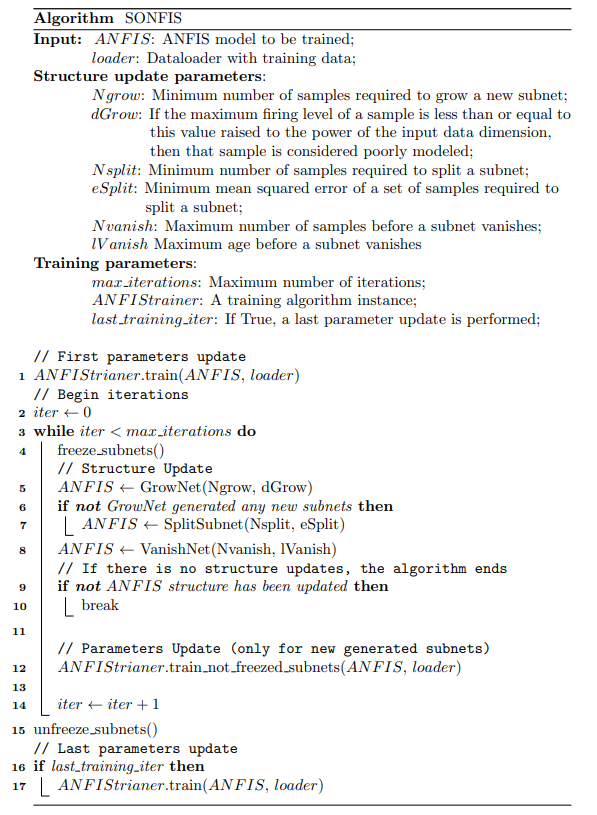

.. _SONFIS:

SONFIS
======

This module contains the implementation of the SONFIS (Self-Organizing
Neuro-Fuzzy Inference System) algorithm, which combines a parameter
learning algorithm with structural adaptation operators for rule growing,
splitting, and pruning. This algorithm is only applicable to
:class:`neuro_fuzzy_toolbox.models.anfis.rule_reduced_ANFIS` models.

For more details on the SONFIS algorithm, refer to the original paper:
`SONFIS: Structure Identification and Modeling with a Self-Organizing
Neuro-Fuzzy Inference System <https://doi.org/10.1080/18756891.2016.1175809>`_.

.. raw:: html

    

.. raw:: latex

   \newline

.. autoclass:: neuro_fuzzy_toolbox.training.sonfis.SONFIS
   :members:
   :inherited-members:
   :show-inheritance:
   :special-members: __call__