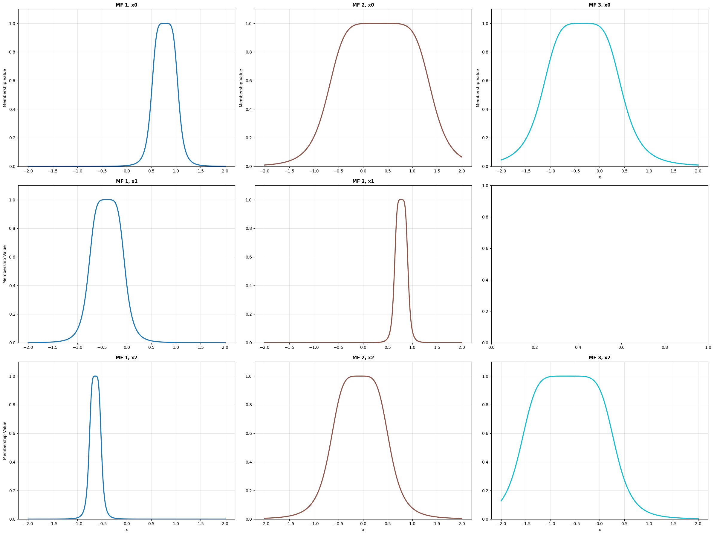
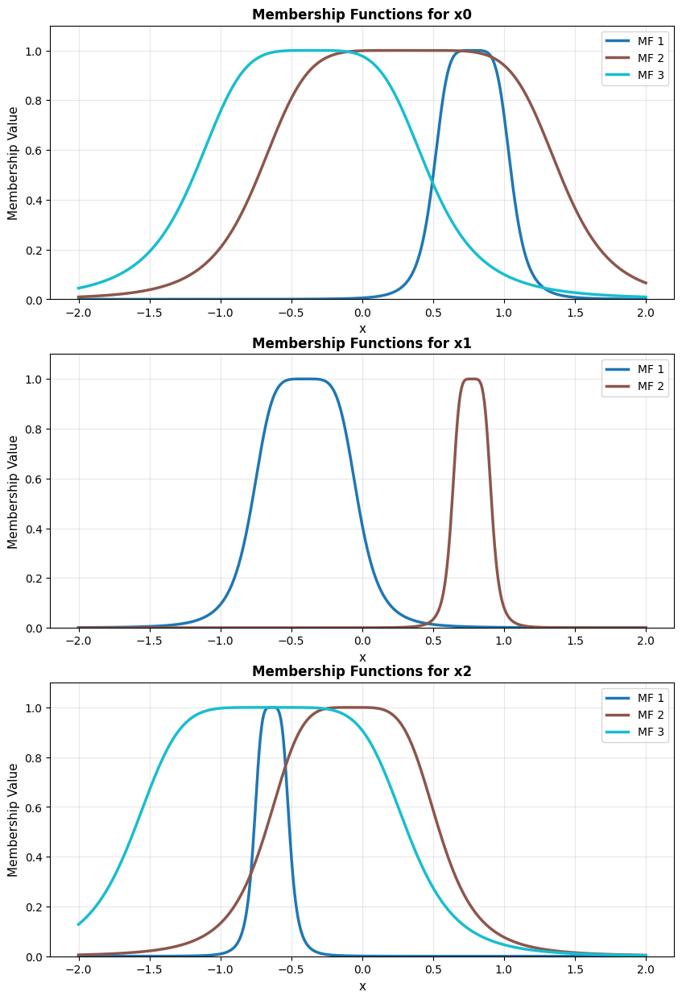
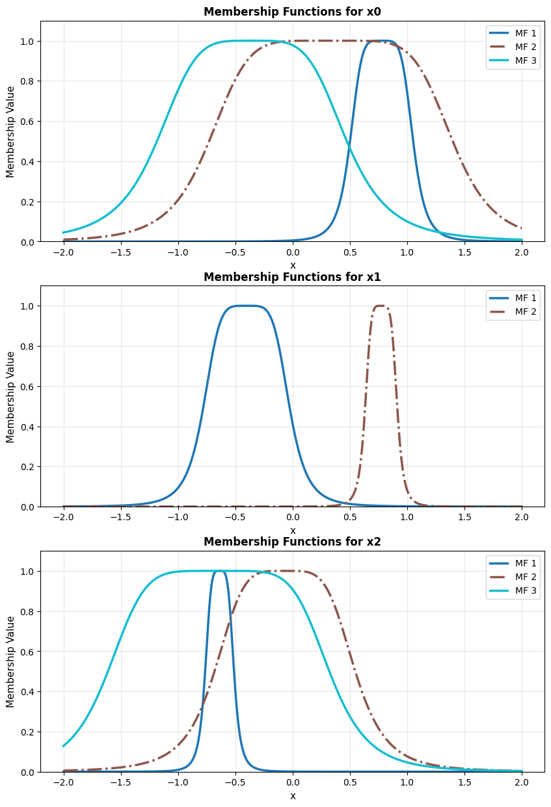
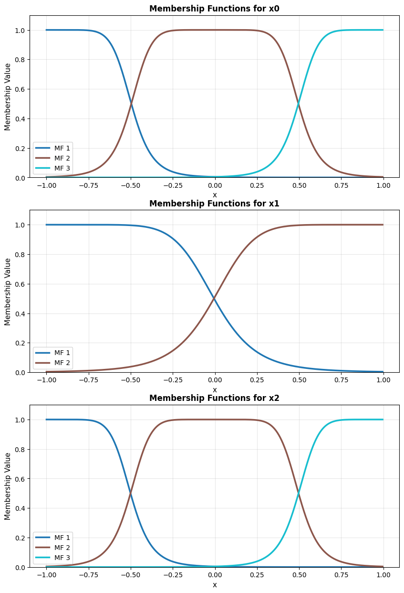

.. _ANFIS usage:

ANFIS Model Basics
==================

.. figure:: ../../_static/models/ANFISmodel.png
    :align: center
    :alt: ANFIS model architecture (source: authors)

    ANFIS model architecture (source: authors)

This section describes how to instantiate the classical ANFIS model implemented
in Neuro-Fuzzy Toolbox and introduces some useful methods for interacting with it.

1. Import
---------

.. code-block:: python

    import neuro_fuzzy_toolbox as nft
    import torch

2. Instantiation
----------------

2.1 Instantiation parameters
^^^^^^^^^^^^^^^^^^^^^^^^^^^^^
The parameters available for instantiating an ANFIS model are the following:

- **mf_distribution**: List containing the number of membership functions for
  each input feature.
- **outputs**: Number of model outputs. Default is 1.
- **membership_function**: Membership function to use. Default is
  ``GeneralizedBell_MF``.
- **output_type**: Defines the output layer of the model. Accepted values are
  ``'default'`` (no output layer; classical mode for regression problems),
  ``'sigmoid'`` (output layer with sigmoid activation), and ``'softmax'``
  (output layer with softmax activation). Default is ``'default'``.
- **features**: Iterable containing the names of the input variables considered
  by the model as strings. Default is ``None``, which produces the list
  *[x0, x1, ...]*.
- **dtype**: Data type of the tensors holding the model parameters. Default is
  ``torch.float32``.

.. _disp-membership-functions:

2.2 Membership functions
^^^^^^^^^^^^^^^^^^^^^^^^^
The membership functions (MFs) available for the ANFIS model are the following:

.. table::
    :align: center

    +----------------------+-----------------------------------------------------------------+
    | Class Name           | Membership Function                                             |
    +======================+=================================================================+
    | GeneralizedBell_MF   | :math:`\frac{1}{1 + \left(\frac{|x - c|}{a}\right)^{2b}}`       |
    +----------------------+-----------------------------------------------------------------+
    | Gaussian_MF          | :math:`e^{-\frac{(x - \mu)^2}{2\sigma^2}}`                      |
    +----------------------+-----------------------------------------------------------------+
    | HighSlopeBell_MF     | :math:`\frac{1}{1 + \left(\frac{|x - c|}{a}\right)^{2\cdot 8}}` |
    +----------------------+-----------------------------------------------------------------+

.. note::
    For more information on the membership functions implemented in Neuro-Fuzzy
    Toolbox, see :ref:`API Reference - Membership Functions <Membership Functions>`.

2.3 Instantiation example
^^^^^^^^^^^^^^^^^^^^^^^^^^
The following example uses randomly generated data with 3 features.

.. code-block:: python

    # Simulating a dataset of 200 samples with 3 features
    x_train = 2 * torch.rand(200, 3) - 1  # shape must be (200, 3)
    y_train = torch.rand(200)              # shape must be (200,)

    x_train

.. code-block:: python

    tensor([[ 0.9675,  0.4610,  0.3263],
            [-0.0157,  0.0160, -0.7043],
            [-0.8187, -0.3378,  0.4585],
            [ 0.2782, -0.5758,  0.7650],
            [-0.5861,  0.8199, -0.0063],
            ...

To instantiate an ANFIS model, the **membership function distribution** must
first be defined according to the **number of inputs** (this is the only
parameter with no default value and must therefore always be specified
explicitly). This is done by providing a list containing the number of MFs
for each input feature. For a 3-feature dataset, the following distribution
can be defined:

.. code-block:: python

    mf_distribution = [3, 2, 3]

This specifies that the first and third features have 3 MFs each, while the
second has 2.

The model can then be instantiated using the defined distribution:

.. code-block:: python

    model = nft.ANFIS(
        mf_distribution=mf_distribution,
        outputs=1,                               # 1 output
        membership_function=nft.GeneralizedBell_MF,
        output_type='default'
    )

.. note::
    All model parameters (premises and consequents) will be initialized
    randomly.

3. Selected Methods
-------------------
The following methods are available for inspecting and interacting with an
instantiated model.

.. important::
    All methods presented in this section are valid for any ANFIS model variant
    implemented in Neuro-Fuzzy Toolbox. These variants are described in
    :ref:`ANFIS Variants <anfis-variants-usage>`.

Premise visualization
^^^^^^^^^^^^^^^^^^^^^^
The *plot_premises()* method plots the MFs of the model premises. Depending
on the defined MF distribution, some subplots may be empty.

.. code-block:: python

    model.plot_premises()

    model.plot_premises() output

MFs can also be grouped by input dimension using the ``group_by_dim=True``
parameter.

.. code-block:: python

    model.plot_premises(group_by_dim=True)

    model.plot_premises(group_by_dim=True) output

Custom line styles that cycle across MFs can be specified via the
``linestyles`` parameter.

.. code-block:: python

    model.plot_premises(group_by_dim=True, linestyles=['-', '-.'])

    model.plot_premises(group_by_dim=True, linestyles=['-', '-.']) output

Premise initialization
^^^^^^^^^^^^^^^^^^^^^^^
The *init_premises()* method initializes the premise parameters from the
training data.

.. code-block:: python

    model.init_premises(x_train)

    model.plot_premises(group_by_dim=True)

    model.plot_premises(group_by_dim=True) output

Get premise values
^^^^^^^^^^^^^^^^^^^
The **model.get_premises_structure()** method returns the premise parameters
in tabular form as a Pandas DataFrame
(see `Pandas Documentation <https://pandas.pydata.org/docs/#>`_).

.. code-block:: python

    df = model.get_premises_structure()
    print(df.to_string())

.. code-block:: text

                x0                            x1                            x2                    
                 a         b         c         a         b         c         a         b         c
    MF 1  0.275562  2.513212  0.776741  0.375067  2.445117 -0.402762  0.125963  2.208311 -0.637243
    MF 2  1.063002  2.953724  0.334411  0.139761  2.501321  0.773252  0.614135  2.253394 -0.067316
    MF 3  0.828421  2.231182 -0.355428       NaN       NaN       NaN  0.965939  2.838505 -0.645566

NaN values indicate that no MF exists for the corresponding feature at that
position.

The **model.get_premises()** method returns the parameters in a more
manipulation-friendly format: a list of tensors, one per input feature
(of length ``input_size``).

.. code-block:: python

    model.get_premises()

.. code-block:: python

    [tensor([[ 0.2756,  2.5132,  0.7767],
             [ 1.0630,  2.9537,  0.3344],
             [ 0.8284,  2.2312, -0.3554]]),
     tensor([[ 0.3751,  2.4451, -0.4028],
             [ 0.1398,  2.5013,  0.7733]]),
     tensor([[ 0.1260,  2.2083, -0.6372],
             [ 0.6141,  2.2534, -0.0673],
             [ 0.9659,  2.8385, -0.6456]])]

.. note::
    In this case, each tensor has shape :math:`(num\_mfs \times 3)`, where
    ``num_mfs`` is the number of MFs for that feature and 3 corresponds to
    the parameters :math:`a`, :math:`b`, and :math:`c` of
    ``GeneralizedBell_MF``. If ``Gaussian_MF`` were used instead, the shape
    would be :math:`(num\_mfs \times 2)`, since ``Gaussian_MF`` has only two
    parameters (:math:`\mu` and :math:`\sigma`).

The **model.get_premises_as_parameters_list()** method returns the premises
as an iterable of ``nn.Parameter`` objects stored internally in the model:

.. code-block:: python

    model.get_premises_as_parameters_list()

.. code-block:: text

    ParameterList(
        (0): Parameter containing: [torch.float32 of size 3x3]
        (1): Parameter containing: [torch.float32 of size 2x3]
        (2): Parameter containing: [torch.float32 of size 3x3]
    )

To inspect the values:

.. code-block:: python

    for i, rule in enumerate(model.get_premises_as_parameters_list()):
        print(f"Feature {i+1} premises:\n", rule, "\n")

.. code-block:: text

    Feature 1 premises:
     Parameter containing:
    tensor([[ 0.2756,  2.5132,  0.7767],
            [ 1.0630,  2.9537,  0.3344],
            [ 0.8284,  2.2312, -0.3554]], requires_grad=True) 

    Feature 2 premises:
     Parameter containing:
    tensor([[ 0.3751,  2.4451, -0.4028],
            [ 0.1398,  2.5013,  0.7733]], requires_grad=True) 

    Feature 3 premises:
     Parameter containing:
    tensor([[ 0.1260,  2.2083, -0.6372],
            [ 0.6141,  2.2534, -0.0673],
            [ 0.9659,  2.8385, -0.6456]], requires_grad=True)

.. tip::

    The *get_premises_as_parameters_list()* method is useful for initializing
    PyTorch optimizers when implementing custom training procedures. See
    :ref:`Custom training <custom-training>` for details.

Get consequent values
^^^^^^^^^^^^^^^^^^^^^^
Analogous methods are available for the consequent parameters. The
**model.get_consequents()** method returns the consequent parameters stored in
the model as a tensor of shape
:math:`(outputs \times num\_rules \times (input\_size + 1))`, where
:math:`outputs` is the number of model outputs, :math:`num\_rules` is the
number of rules, and :math:`input\_size + 1` corresponds to the parameters of
each rule (one coefficient per input feature plus the bias term).

.. code-block:: python

    model.get_consequents()

.. code-block:: text

    tensor([[[ 0.5301, -0.2289,  0.8846,  0.3022],
             [-0.4119,  0.3536,  0.1352, -0.3768],
             [-0.8613,  0.1430, -0.4151, -0.0445],
             [ 0.1645,  0.1320,  0.2322,  0.9766],
             [ 0.7077, -0.9880, -0.5299,  0.1812],
             [-0.6640,  0.8243,  0.2896,  0.6760],
             [-0.7384, -0.0971, -0.6692,  0.1911],
             [ 0.3822,  0.7965,  0.9330, -0.4947],
             [-0.9448,  0.8875, -0.0080, -0.5199],
             [-0.8340, -0.9991,  0.3486,  0.7330],
             [ 0.5894, -0.4916, -0.9528,  0.4650],
             [-0.0547,  0.2091,  0.7892,  0.2865],
             [ 0.4784, -0.4209,  0.9360,  0.7171],
             [-0.6172,  0.3039,  0.2237,  0.5542],
             [ 0.3943, -0.4589, -0.3258,  0.8626],
             [ 0.0125, -0.3117,  0.4590, -0.2067],
             [ 0.2149, -0.3138,  0.0204, -0.3937],
             [ 0.6653, -0.1333, -0.6162, -0.2090]]])

The **model.get_consequents_structure()** method returns the consequent
parameters in tabular form as a list of Pandas DataFrames, one per model
output.

.. code-block:: python

    dfs = model.get_consequents_structure()
    for i, df in enumerate(dfs):
        print(f"Output {i+1}:\n", df.to_string(), "\n")

.. code-block:: text

    Output 1:
                    x0        x1        x2          
                   c0        c1        c2        c3
    rule 1  -0.382065  0.913401  0.874547  0.597923
    rule 2  -0.089143  0.855073 -0.670351 -0.379125
    rule 3   0.118713  0.616323 -0.208217 -0.854220
    rule 4  -0.443418  0.714479  0.295737  0.059209
    rule 5  -0.348620  0.352026 -0.341892  0.920784
    rule 6  -0.675548 -0.300991 -0.240290  0.096369
    rule 7  -0.665461 -0.537926  0.260524  0.317758
    rule 8   0.973986  0.066278 -0.043222  0.356516
    rule 9   0.048740 -0.179825 -0.103460  0.048633
    rule 10  0.482887  0.163292 -0.209825  0.950138
    rule 11 -0.155697 -0.112747 -0.608693 -0.597133
    rule 12 -0.789493  0.679962 -0.805681  0.673177
    rule 13  0.737387 -0.177445  0.334493  0.328383
    rule 14 -0.557695  0.588001 -0.511353  0.470869
    rule 15  0.770624  0.362488 -0.824404  0.275850
    rule 16  0.562982  0.853030 -0.748265  0.331890
    rule 17 -0.835750  0.076656  0.387303 -0.537785
    rule 18  0.761043  0.821287  0.446539 -0.531705

The **model.get_consequents_as_parameters_list()** method returns an iterable
of ``nn.Parameter`` objects holding the consequent parameters — in this case,
stored as a single parameter:

.. code-block:: python

    model.get_consequents_as_parameters_list()

.. code-block:: text

    [Parameter containing:
     tensor([[[ 0.5301, -0.2289,  0.8846,  0.3022],
              [-0.4119,  0.3536,  0.1352, -0.3768],
              [-0.8613,  0.1430, -0.4151, -0.0445],
              [ 0.1645,  0.1320,  0.2322,  0.9766],
              [ 0.7077, -0.9880, -0.5299,  0.1812],
              [-0.6640,  0.8243,  0.2896,  0.6760],
              [-0.7384, -0.0971, -0.6692,  0.1911],
              [ 0.3822,  0.7965,  0.9330, -0.4947],
              [-0.9448,  0.8875, -0.0080, -0.5199],
              [-0.8340, -0.9991,  0.3486,  0.7330],
              [ 0.5894, -0.4916, -0.9528,  0.4650],
              [-0.0547,  0.2091,  0.7892,  0.2865],
              [ 0.4784, -0.4209,  0.9360,  0.7171],
              [-0.6172,  0.3039,  0.2237,  0.5542],
              [ 0.3943, -0.4589, -0.3258,  0.8626],
              [ 0.0125, -0.3117,  0.4590, -0.2067],
              [ 0.2149, -0.3138,  0.0204, -0.3937],
              [ 0.6653, -0.1333, -0.6162, -0.2090]]], requires_grad=True)]

.. tip::

    Like *get_premises_as_parameters_list()*, the
    **get_consequents_as_parameters_list()** method is intended for initializing
    PyTorch optimizers and is used internally by the training algorithms
    implemented in Neuro-Fuzzy Toolbox. See :ref:`Training <Training-usage>`
    for details on the available training algorithms and custom training
    procedures.

Consequent initialization
^^^^^^^^^^^^^^^^^^^^^^^^^^
As with premises, consequents can also be initialized from data via a
least-squares estimation:

.. code-block:: python

    model.init_consequents(x_train, y_train)

.. note::
    For more information on this method and its implementation, see
    :ref:`ANFIS API reference <ANFIS>`.

Get rule information
^^^^^^^^^^^^^^^^^^^^^
The classical ANFIS model generates fuzzy rules based on the combinatorial
product of the MFs defined for each input feature. The **model.rules**
property returns the total number of rules in the model.

.. code-block:: python

    model.rules  # In this case: 3 * 2 * 3 = 18

.. code-block:: text

    18

Detailed rule information can be retrieved with the
**model.get_rules_structure()** method, which returns a Pandas DataFrame
with the model parameters organized by rule.

.. code-block:: python

    df_rules = model.get_rules_structure()
    print(df_rules.to_string())

.. code-block:: text

             premises                                                                  output 1 consequents                              
                   x0                       x1                       x2                                  x0        x1        x2          
                    a    b         c         a    b         c         a    b         c                   c0        c1        c2        c3
    rule 1   0.485433  4.0 -0.998063  0.997669  4.0 -0.998142  0.497743  4.0 -0.999034             0.871878  0.826484  0.058868 -0.686231
    rule 2   0.485433  4.0 -0.998063  0.997669  4.0 -0.998142  0.497743  4.0 -0.003548             0.174152  0.915871  0.700253 -0.695330
    rule 3   0.485433  4.0 -0.998063  0.997669  4.0 -0.998142  0.497743  4.0  0.991938            -0.378210 -0.518292 -0.624950  0.475157
    rule 4   0.485433  4.0 -0.998063  0.997669  4.0  0.997196  0.497743  4.0 -0.999034            -0.831691  0.423014 -0.144856  0.655579
    rule 5   0.485433  4.0 -0.998063  0.997669  4.0  0.997196  0.497743  4.0 -0.003548             0.993477 -0.496301 -0.820423  0.251142
    rule 6   0.485433  4.0 -0.998063  0.997669  4.0  0.997196  0.497743  4.0  0.991938            -0.323971  0.175129 -0.584292  0.300875
    rule 7   0.485433  4.0 -0.027197  0.997669  4.0 -0.998142  0.497743  4.0 -0.999034            -0.775522  0.940813 -0.945905 -0.331948
    rule 8   0.485433  4.0 -0.027197  0.997669  4.0 -0.998142  0.497743  4.0 -0.003548            -0.838004 -0.148445 -0.677109  0.593572
    rule 9   0.485433  4.0 -0.027197  0.997669  4.0 -0.998142  0.497743  4.0  0.991938            -0.348051  0.568019  0.200678  0.959820
    rule 10  0.485433  4.0 -0.027197  0.997669  4.0  0.997196  0.497743  4.0 -0.999034             0.862614 -0.960059  0.521483  0.946265
    rule 11  0.485433  4.0 -0.027197  0.997669  4.0  0.997196  0.497743  4.0 -0.003548             0.110681  0.713140 -0.962105 -0.330632
    rule 12  0.485433  4.0 -0.027197  0.997669  4.0  0.997196  0.497743  4.0  0.991938             0.660940 -0.452149  0.525000  0.271220
    rule 13  0.485433  4.0  0.943669  0.997669  4.0 -0.998142  0.497743  4.0 -0.999034            -0.273925  0.425118  0.018813  0.599521
    rule 14  0.485433  4.0  0.943669  0.997669  4.0 -0.998142  0.497743  4.0 -0.003548             0.224087 -0.539074 -0.348814 -0.732341
    rule 15  0.485433  4.0  0.943669  0.997669  4.0 -0.998142  0.497743  4.0  0.991938            -0.748455 -0.223302 -0.001055  0.808488
    rule 16  0.485433  4.0  0.943669  0.997669  4.0  0.997196  0.497743  4.0 -0.999034             0.803560 -0.220144  0.959322 -0.014778
    rule 17  0.485433  4.0  0.943669  0.997669  4.0  0.997196  0.497743  4.0 -0.003548            -0.599493 -0.807238 -0.561908  0.364961
    rule 18  0.485433  4.0  0.943669  0.997669  4.0  0.997196  0.497743  4.0  0.991938             0.787167  0.156500  0.121834 -0.989198

.. note::
    For rule visualization and relevance evaluation methods, see
    :ref:`Rule Inspection and Analysis <Rule_Inspection_and_Analysis>`.

4. Forward and predict methods
-------------------------------
The **forward** method returns the model output for a batch of input data as
a PyTorch tensor. This method constructs the PyTorch computational graph,
enabling backpropagation and gradient-based training.

.. code-block:: python

    model(x_train[:10])

.. code-block:: python

    tensor([ 0.0515,  0.2146,  0.5617,  0.2492,  0.4197,  0.1205,  0.0435,  0.2851, 0.1256, -0.3293], grad_fn=<SqueezeBackward1>)

To suppress graph construction, use PyTorch's ``no_grad`` context manager:

.. code-block:: python

    with torch.no_grad():
        output = model(x_train[:10])

    print(output)

.. code-block:: python

    tensor([ 0.0515,  0.2146,  0.5617,  0.2492,  0.4197,  0.1205,  0.0435,  0.2851, 0.1256, -0.3293])

The **predict** method returns the model prediction for a batch of input data
without constructing the computational graph.
**Depending on the output type, additional post-processing operations are
applied to the result.** Specifically, an *argmax* operation is used to obtain
predicted class labels when the model has multiple outputs with a softmax
output layer (see :ref:`Output Types <output-types-usage>`).

.. code-block:: python

    model.predict(x_train[:10])

.. code-block:: python

    tensor([ 0.0515,  0.2146,  0.5617,  0.2492,  0.4197,  0.1205,  0.0435,  0.2851, 0.1256, -0.3293])

.. note::
    For information on the ANFIS model variants available in Neuro-Fuzzy
    Toolbox and their implications, see
    :ref:`ANFIS Variants <anfis-variants-usage>`.