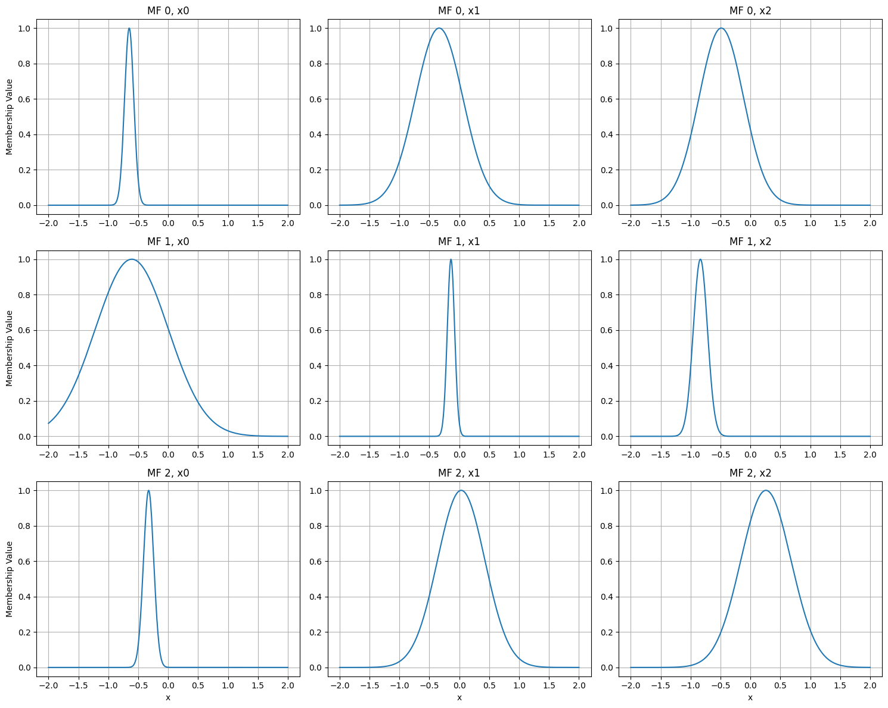
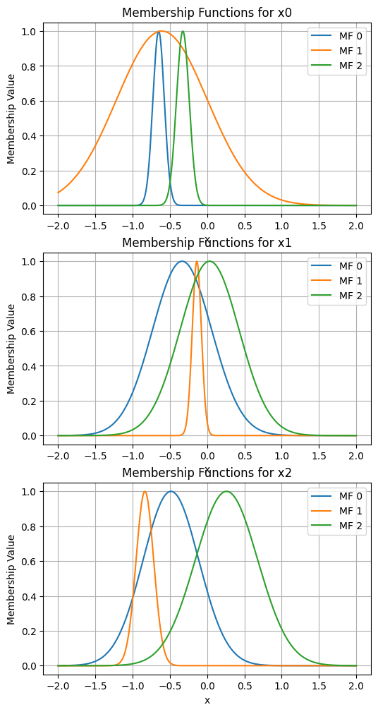
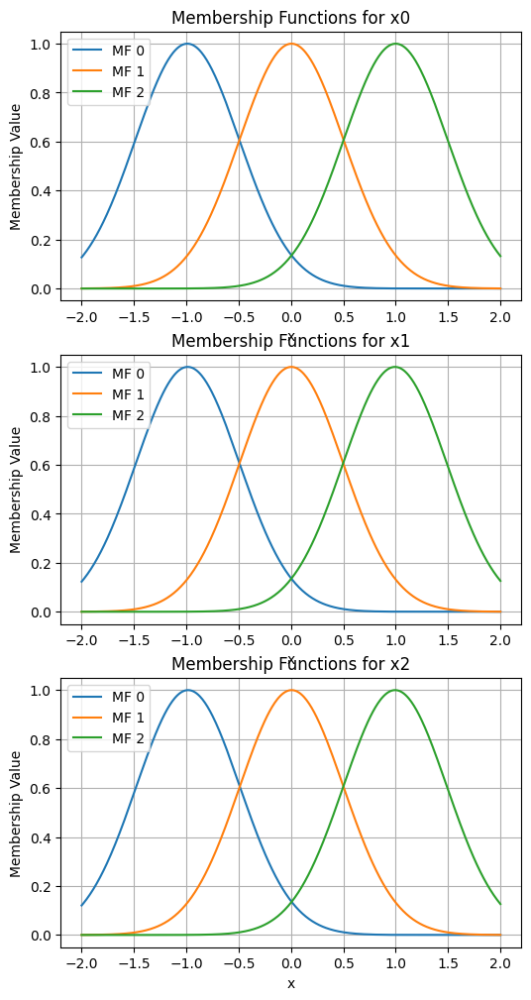
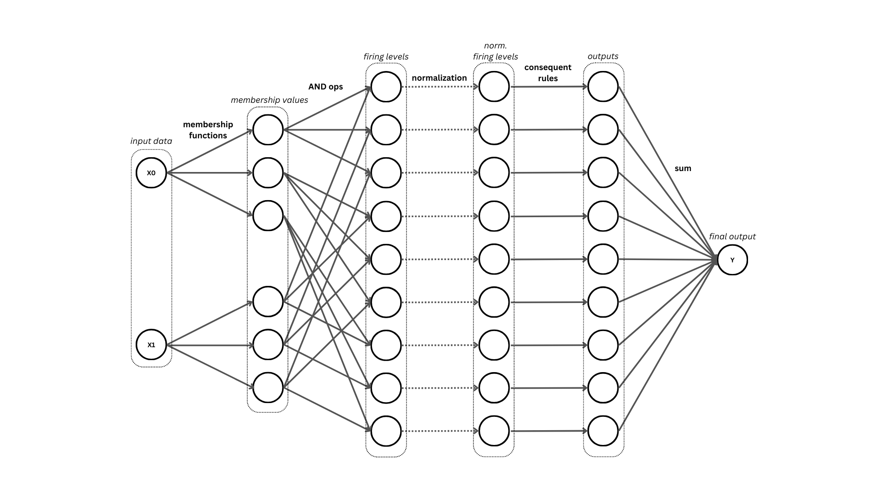
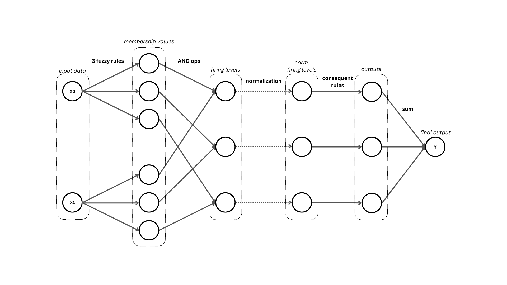

.. _h_ANFIS usage:

h_ANFIS
=======

Modelo ANFIS cuyo número de funciones de membresía es igual para todos los features de los datos de entrada.

Importación
-----------

.. code-block:: python

    import sys
    import os

    sys.path.append(os.path.abspath('../'))

    import neuro_fuzzy_toolbox as nft
    import torch

Instanciación
-------------
Los parámetros a tomar en cuenta para instanciar un modelo h_ANFIS son los siguientes:

- **input_size**: Número de features de los datos de entrada.
- **num_mfs**: Número de funciones de membresía para cada feature.
- **outputs**: Número de salidas del modelo. Por defecto es 1.
- **membership_function**: Función de membresía a utilizar. Puede ser Gaussian_MF, GeneralizedBell_MF. Por defecto es GeneralizedBell_MF.
- **output_type**: Tipo de salida del modelo. Puede ser 'default', 'sigmoid' o 'softmax'. El valor por defecto es 'default'.
- **rule_reduced**: Booleano que indica si se quiere instanciar un modelo h_ANFIS con reglas reducidas. Por defecto es False. Más detalles en :ref:`rule-reduced ANFIS <rule-reduced ANFIS>`.
- **features**: Iterable que contiene los nombres de las características de las variables de entrada como strings consideradas en el modelo (input features). Por defecto es la lista: *[x0, x1, ...]*.
- **dtype**: Tipo de dato de los tensores que contienen los parámetros del modelo. Por defecto es torch.float32.

.. note::

    Con respecto al parámetro **output_type**: si se instancia un modelo con **output_type='sigmoid'**, el modelo incorporará una capa sigmoide a la salida, mientras que con 
    **output_type='softmax'**, se añade una función softmax opcional al método forward. Más detalles en :ref:`Salida sigmoide y softmax <Salida sigmoide y softmax>`.

Se utilizarán datos de entrenamiento generados aleatoriamente para el ejemplo a continuación.

.. code-block:: python

    # Se simulará un conjunto de datos de 200 muestras con 3 features
    x_train = 2 * torch.rand(200, 3) - 1 # la dimensión debe ser (200, 3)
    y_train = torch.rand(200) # la dimensión debe ser (200,)

A continuación se instancia un modelo h_ANFIS con 3 funciones de membresía para cada feature de los datos de entrada y con una salida. Se mostrarán todos los parámetros relevantes para instanciar la clase.

.. code-block:: python

    model = nft.h_ANFIS(
        input_size=x_train.shape[1], # 3 features
        num_mfs=3, # 3 funciones de membresía
        outputs=1, # 1 salida
        membership_function=nft.Gaussian_MF, # Función de membresía gaussiana
        output_type='default'
    )

Algunos métodos útiles
----------------------

plot_premises
~~~~~~~~~~~~~
El método *plot_premises()* permite visualizar las funciones de membresía de los antecedentes del modelo.

.. code-block:: python

    model.plot_premises()

.. code-block:: python

    model.plot_premises(group_by_dim=True)

init_premises
~~~~~~~~~~~~~
Ahora mismo el modelo se encuentra con todos sus parámetros inicializados aleatoriamente.
En caso de que se estime conveniente, es posible inicializar los parámetros de los antecedentes en base a los datos con los que se trabajará:

.. code-block:: python

    model.init_premises(x_train)

    model.plot_premises(group_by_dim=True)

show_premises_structure, premises_structure y get_premises
~~~~~~~~~~~~~~~~~~~~~~~~~~~~~~~~~~~~~~~~~~~~~~~~~~~~~~~~~~
Para visualizar los parámetros en cuestión se puede utilizar el método **show_premises_structure()**, el cual imprime por pantalla un dataframe con los valores de los parámetros de las funciones de membresía:

.. code-block:: python

    model.show_premises_structure()

.. code-block:: python

           mu (x0)  sigma (x0)   mu (x1)  sigma (x1)   mu (x2)  sigma (x2)
    MF 0 -0.990143    0.497452 -0.986824    0.494897 -0.983210    0.494364
    MF 1  0.004761    0.497452  0.002970    0.494897  0.005518    0.494364
    MF 2  0.999665    0.497452  0.992764    0.494897  0.994247    0.494364

El método **model.premises_structure** retorna el dataframe correspondiente.

Por otro lado, **model.get_premises()** retorna un tensor que contiene estos parámetros (como están almacenados en el modelo):

.. code-block:: python

    model.get_premises()

.. code-block:: python

    tensor([[[-0.9869,  0.4963],
             [ 0.0056,  0.4963],
             [ 0.9981,  0.4963]],

            [[-0.9966,  0.4973],
             [-0.0021,  0.4973],
             [ 0.9924,  0.4973]],

            [[-0.9920,  0.4968],
             [ 0.0015,  0.4968],
             [ 0.9951,  0.4968]]])

.. note::

    La dimensión del tensor es (input_size, num_mfs, 2), donde input_size es el número de features de los datos de entrada, num_mfs es el número de funciones de membresía y 2 corresponde a los parámetros mu y sigma de las funciones de membresía (Gaussian_MF).

show_consequents_structure, consequents_structure y get_consequents
~~~~~~~~~~~~~~~~~~~~~~~~~~~~~~~~~~~~~~~~~~~~~~~~~~~~~~~~~~~~~~~~~~~
En cuanto a los consecuentes, hay métodos análogos a los de los antecedentes: **show_consequents_structure()**, **model.consequents_structure** y **get_consequents()**. 

.. code-block:: python

    model.show_consequents_structure()

.. code-block:: python

    - Output 1:
              c0 (x0)   c1 (x1)   c2 (x2)        c3
    rule 1  -0.402982  0.913287 -0.147453 -0.570277
    rule 2  -0.558947 -0.600798 -0.186016 -0.840755
    rule 3   0.168397 -0.883966  0.474520  0.312040
    rule 4  -0.122751  0.630311 -0.797790  0.563108
    rule 5   0.361740 -0.286652 -0.325836  0.847129
    rule 6  -0.456639 -0.769045 -0.617894  0.075701
    rule 7  -0.118061 -0.842846 -0.196719 -0.067862
    rule 8  -0.775172  0.827982 -0.956070  0.850902
    rule 9  -0.781440 -0.009967  0.381071  0.127973
    rule 10  0.578195  0.767374  0.944861  0.173381
    rule 11 -0.579265  0.665136 -0.931385  0.141964
    rule 12 -0.677500 -0.522054 -0.871355 -0.329690
    rule 13 -0.931001 -0.564158  0.425146 -0.055656
    rule 14 -0.163182  0.894706  0.172442  0.128253
    rule 15 -0.343025  0.517860  0.329148  0.808215
    rule 16  0.975743  0.005502 -0.814048  0.887746
    rule 17 -0.015661 -0.065317 -0.171591  0.917433
    rule 18 -0.682314  0.237104  0.514205  0.443589
    rule 19 -0.061958 -0.398458  0.066680  0.805317
    rule 20 -0.109509  0.672676  0.771990  0.259475
    rule 21 -0.887838  0.148851 -0.494752  0.740001
    rule 22 -0.506924  0.124466 -0.304620  0.406688
    rule 23  0.096541  0.600472  0.615980 -0.438880
    rule 24  0.421969  0.594888 -0.104359  0.558902
    rule 25  0.454787  0.143593 -0.386165 -0.442262
    rule 26 -0.872414  0.364831  0.624177  0.791676
    rule 27  0.880137 -0.213823 -0.404114 -0.578382

La única diferencia es que, en el caso del método **model.consequents_structure**, se retorna una lista con los dataframe correspondientes a cada una de las salidas del modelo. En este caso, como solo hay una salida, se retorna una lista con un solo dataframe.

init_consequents
~~~~~~~~~~~~~~~~
Al igual que con los antecedentes, los consecuentes pueden ser inicializados (se hace una estimación de mínimos cuadrados para su estimación):

.. code-block:: python

    model.init_consequents(x_train, y_train)

    model.show_consequents_structure()

.. code-block:: python

    - Output 1:
               c0 (x0)    c1 (x1)    c2 (x2)         c3
    rule 1  -38.603622  83.139351  -4.721482  35.447437
    rule 2   11.611960 -18.674757 -16.584797  -8.276023
    rule 3    4.777979  12.768584 -24.019762  47.975079
    rule 4  -13.011658  80.083794  13.818563   0.792695
    rule 5   14.744291 -15.238177  14.997739  15.207272
    rule 6   -8.531214  18.137932   7.622557 -17.553904
    rule 7  -46.518402  66.189758  57.811459 -69.268761
    rule 8   -5.500585 -13.139522  21.414112   2.256964
    rule 9    0.178966  24.161200   1.848382 -29.489714
    rule 10 -39.433895 -28.971519 -17.817743 -47.437130
    rule 11   7.517597  13.991263 -17.467180  15.493506
    rule 12  26.560833  -4.370911 -14.732899  15.440524
    rule 13 -11.223594 -27.542837  10.466902  12.842992
    rule 14  10.921582  20.938026  14.123129   2.535148
    rule 15  -9.170781 -15.080878  19.803434 -21.838345
    rule 16 -38.962158 -25.079311 -14.063742  16.590000
    rule 17  -4.855482  26.163994  -6.663449 -23.330303
    rule 18  -1.587998 -20.165577   0.393830  22.284754
    rule 19 -33.708397  63.667454 -24.790689  82.564964
    rule 20  -3.639538 -16.275009  13.400737  -8.231231
    rule 21  59.088257   4.166258  32.328194 -77.644859
    rule 22 -13.431444  50.953583  -6.445808  -0.670563
    rule 23  11.838889 -17.402069 -23.034710 -14.948477
    ...
    rule 26  -2.833748 -13.963975 -10.615835  16.864780
    rule 27  -1.262385  -5.599927 -22.673426  26.784224

forward
~~~~~~~
El método **forward** permite obtener la salida del modelo para un conjunto de datos de entrada en forma de un tensor de PyTorch. Este método genera el grafo de cómputo de PyTorch, lo que permite realizar backpropagation y entrenar el modelo.

.. code-block:: python

    model(x_train[:10])

.. code-block:: python

    tensor([ 0.0515,  0.2146,  0.5617,  0.2492,  0.4197,  0.1205,  0.0435,  0.2851, 0.1256, -0.3293], grad_fn=<SqueezeBackward1>)

.. note::

    El método se comporta de diferente manera dependiendo del tipo de salida del modelo (especificado por el parámetro *output_type*).

Para evitar generar el grafo de cómputo de PyTorch, se puede utilizar el método **no_grad** de PyTorch.

.. code-block:: python

    with torch.no_grad():
        output = model(x_train[:10])

    print(output)

.. code-block:: python
    
    tensor([ 0.0515,  0.2146,  0.5617,  0.2492,  0.4197,  0.1205,  0.0435,  0.2851, 0.1256, -0.3293])

predict
~~~~~~~
El método **predict** retorna la predicción del modelo para un conjunto de datos de entrada en forma de un array de numpy sin generar el grafo de cómputo de PyTorch 
(como lo hace el método forward). Dependiendo del tipo de salida del modelo se realizan ciertas operaciones especiales para entregar el resultado.

.. code-block:: python

    model.predict(x)

.. code-block:: python

    array([ 0.05152027,  0.2146402 ,  0.561749  ,  0.24923508,  0.4197383 , 0.12053609,  0.04348549,  0.28514066,  0.12556443, -0.32934883], dtype=float32)

.. _Salida sigmoide y softmax:

Salida sigmoide y softmax
-------------------------
El modelo h_ANFIS puede ser instanciado con distintos tipos de salida según el parámetro *output_type*, si es:

- **'default'**: La salida del modelo será la que está establecida por defecto (simplemente la suma de las salidas de cada una de las reglas del modelo).
- **'sigmoid'**: Se incorpora una capa sigmoide en la salida del modelo.
- **'softmax'**: Las función forward del modelo incorpora una función softmax opcional (activada por un atributo booleano: **return_probs**).

.. note::
    
    La razón por la cual se incorpora una función opcional y no una capa softmax directamente es debido a como la función de pérdida *cross entropy* está implementada en PyTorch.
    Esta calcula la función softmax internamente, por lo que no es necesario hacerlo explícitamente en el modelo.

Esto cambia la estructura del modelo y la forma en que se obtienen las predicciones. A continuación se detallará cómo instanciar el modelo para cada uno de estos casos.

Salida sigmoide
~~~~~~~~~~~~~~~
Si se especifica 'sigmoid' como tipo de salida, el modelo se comportará como un clasificador binario (si tiene una salida). En este caso, se le añadirá una última capa sigmoide al modelo, por lo que su salida (método forward) será un número entre 0 y 1.

.. code-block:: python

    # Se simulará un conjunto de datos de 200 muestras con 2 features
    x_train = 2 * torch.rand(200, 2) - 1 # la dimensión debe ser (200, 2)

Se inicializa el modelo con 2 funciones de membresía para cada feature de los datos de entrada y con una salida sigmoide.

.. code-block:: python

    model = nft.h_ANFIS(
        input_size=x_train.shape[1], # 2 features
        num_mfs=2, # 2 funciones de membresía
        outputs=1, # 1 salida
        output_type='sigmoid'
    )

La salida del modelo (método forward) se vería de la siguiente manera:

.. code-block:: python

    model(x_train[:10])

.. code-block:: python

    tensor([0.4850, 0.4174, 0.5303, 0.5792, 0.5409, 0.3680, 0.4975, 0.5391, 0.4606, 0.5040], grad_fn=<SigmoidBackward0>)

El método *predict* retornará 1 si la probabilidad de la clase positiva es mayor a 0.5, 0 en caso contrario:

.. code-block:: python

    model.predict(x_train[:10])

.. code-block:: python

    array([0, 0, 1, 1, 1, 0, 0, 1, 0, 1])

Salida softmax
~~~~~~~~~~~~~~
Si se especifica 'softmax' como tipo de salida, el modelo se comportará como un clasificador multiclase (si se especifican más de 2 salidas). En este caso, el método *forward* tendrá un parámetro adicional llamado *return_probs* que, si es True, retornará las probabilidades de las clases (las salidas pasarán por una función softmax), en caso contrario, retornará los logits sin normalizar de las clases.
En este caso, se debe especificar el número de clases en el parámetro *outputs*.

.. code-block:: python

    # Se simulará un conjunto de datos de 200 muestras con 3 features
    x_train = 2 * torch.rand(200, 3) - 1 # la dimensión debe ser (200, 3)

Se inicializa el modelo con 2 funciones de membresía para cada feature de los datos de entrada y con una salida softmax.

.. code-block:: python

    model = nft.h_ANFIS(
        input_size=x_train.shape[1], # 3 features
        num_mfs=3, # 3 funciones de membresía
        outputs=4, # 4 clases
        membership_function=Gaussian_MF, # Función de membresía gaussiana
        output_type='softmax'
    )

La salida del modelo (método forward) serán los logits de cada clase:

.. code-block:: python

    model(x_train[:10])

.. code-block:: python

    tensor([[ 0.4425,  0.2284,  0.3152,  0.1618],
            [ 0.3934,  0.1950,  0.3640,  0.2418],
            [ 0.2840,  0.2651,  0.3129,  0.1921],
            [ 0.2482,  0.5278,  0.3655, -0.7933],
            [ 0.0890,  0.1157,  0.2529,  0.0178],
            [ 0.1855,  0.2477,  0.2571, -0.1530],
            [ 0.4424, -0.0780,  0.4180,  0.2541],
            [ 0.2046,  0.4696,  0.2142,  0.0049],
            [ 0.4243, -0.0578,  0.3322,  0.1703],
            [ 0.5209,  0.3951,  0.3004,  0.5666]], grad_fn=<SqueezeBackward1>)

Si se especifica *return_probs=True* en este método, se retornarán las probabilidades de las clases (pasa por una función softmax):

.. code-block:: python

    model(x_train[:10], return_probs=True)

.. code-block:: python

    tensor([[0.2905, 0.2345, 0.2557, 0.2194],
            [0.2739, 0.2247, 0.2660, 0.2354],
            [0.2549, 0.2501, 0.2624, 0.2325],
            [0.2632, 0.3480, 0.2959, 0.0929],
            [0.2418, 0.2483, 0.2848, 0.2251],
            [0.2597, 0.2763, 0.2789, 0.1851],
            [0.2942, 0.1749, 0.2871, 0.2437],
            [0.2420, 0.3154, 0.2443, 0.1982],
            [0.3026, 0.1868, 0.2759, 0.2347],
            [0.2680, 0.2364, 0.2150, 0.2806]], grad_fn=<SoftmaxBackward0>)

El método *predict* retornará el índice de la clase con mayor probabilidad:

.. code-block:: python

    model.predict(x_train[:10])

.. code-block:: python

    array([0, 0, 2, 1, 2, 2, 0, 1, 0, 3])

.. tip::
    
    El valor 'softmax' junto con la multiple salida se puede usar para clasificación binaria de todas maneras (con 2 outputs), la diferencia estará en la estructura interna del modelo, pues tendrá conjuntos de parámetros concecuentes distintos para cada salida:

    .. figure:: ../../_static/2_output_anfis.png
        :align: center
        :width: 600px
        :alt: binary class example 1
    
    Si se usa 'sigmoid' con 1 output, el modelo tendrá una capa sigmoide al final y 1 un conjunto de parámetros consecuentes para la salida en cuestión.

    .. figure:: ../../_static/1_output_binary_anfis.png
        :align: center
        :width: 600px
        :alt: binary class example 2
    
    Sin embargo la aplicación es la misma, queda en el criterio del usuario decidir cuál usar.

Múltiples salidas
-----------------
La única diferencia en la arquitectura del modelo al trabajar con múltiples salidas es la cantidad de parámetros consecuentes generados. 

.. code-block:: python

    # Se simulará un conjunto de datos de 200 muestras con 2 features
    x_train = 2 * torch.rand(200, 2) - 1 # la dimensión debe ser (200, 2)

.. code-block:: python

    # Se instancía un modelo para un problema de regresión con 3 funciones de membresía para cada feature de los datos de entrada y con 2 salidas
    model = nft.h_ANFIS(
        input_size=x_train.shape[1], # 2 features
        num_mfs=3, # 3 funciones de membresía
        outputs=2, # 2 salidas
        membership_function=Gaussian_MF, # Función de membresía gaussiana
        output_type='default'
    )

Por cada salida se generará un conjunto de parámetros concecuentes:

.. code-block:: python

    model.show_consequents_structure()

.. code-block:: python

    - Output 1:
             c0 (x0)   c1 (x1)        c2
    rule 1  0.412696  0.522680  0.090145
    rule 2 -0.976030 -0.419625  0.283456
    rule 3  0.254746  0.443201 -0.872905
    rule 4  0.790756  0.528562  0.858889
    rule 5  0.651066 -0.942244 -0.114714
    rule 6 -0.897736  0.491714 -0.059783
    rule 7 -0.075024  0.502939 -0.868872
    rule 8 -0.819807 -0.380666  0.491858
    rule 9  0.367133 -0.824872  0.538071
    
    
    - Output 2:
             c0 (x0)   c1 (x1)        c2
    rule 1 -0.682649  0.267264  0.636341
    rule 2  0.402898 -0.281733 -0.870279
    rule 3  0.929400  0.168972  0.334629
    rule 4 -0.860564  0.804722  0.599917
    rule 5  0.660574  0.454537  0.582051
    rule 6  0.882556  0.788579  0.761563
    rule 7 -0.752488 -0.172638  0.551565
    rule 8 -0.063006 -0.112478 -0.040473
    rule 9  0.690270  0.598800 -0.420998

Ahora la salida del modelo será de dimensión (batch_size, outputs):

.. code-block:: python

    model(x_train[:10])

.. code-block:: python

    tensor([[-0.2550,  0.4605],
            [ 0.2885,  0.1500],
            [-0.3057,  0.2601],
            [ 0.5863,  0.2624],
            [ 0.1534,  0.4544],
            [-0.4603,  0.4648],
            [ 0.4690,  0.4441],
            [-0.1083,  0.2348],
            [ 0.0827,  0.1670],
            [-0.2726,  0.4799]], grad_fn=<SqueezeBackward1>)

.. tip::

    El modelo también debería ser aplicable a problemas multilabel, bastaría con usar **output_type='sigmoid'** con múltiples salidas.

    .. figure:: ../../_static/multilabel_anfis.png
        :align: center
        :width: 600px
        :alt: multilabel example

    De esta manera se permitirían salidas en las que más de una clase sea detectada. Pero queda a criterio del usuario decidir si usar este enfoque o varios modelos de tipo 'sofmtax' paralelamente.

.. _rule-reduced ANFIS:

rule-reduced ANFIS
------------------
Modelo ANFIS con reglas reducidas. Es una variante del modelo ANFIS homogéneo que reduce el número de reglas y, por ende, el número de parámetros concecuentes en el modelo.

A continuación se muestra una comparación entre el modelo ANFIS homogéneo y el modelo ANFIS con reglas reducidas, ambos con 2 features y 3 funciones de pertenencia por dimensión en los datos de entrada:

- **Modelo ANFIS homogéneo**

- **Modelo rule-reduced ANFIS**

Para su instanciación, la clase h_ANFIS tiene un parámetro llamado `rule_reduced`, el cual debe ser establecido en `True` (Por defecto es `False`):

.. code-block:: python

    import neuro_fuzzy_toolbox as nft

    # Se simulará un conjunto de datos de 200 muestras con 2 features
    x_train = 2 * torch.rand(200, 2) - 1 # la dimensión debe ser (200, 2)

.. code-block:: python

    model = nft.h_ANFIS(
        input_size=2,
        num_mfs=3,
        outputs=1,
        rule_reduced=True
    )

Los parámetros concecuentes generados por el modelo ANFIS con reglas reducidas serán claramente menores que los generados por el modelo ANFIS homogéneo:

.. code-block:: python

    model.show_consequents_structure()

.. code-block:: python

    - Output 1:
             c0 (x0)   c1 (x1)        c2
    rule 1 -0.729495 -0.345188  0.441197
    rule 2  0.894614  0.420384 -0.635486
    rule 3  0.235036 -0.248037  0.702353

Todos los métodos y herramientas presentados con el modelo ANFIS homogéneo (:ref:`h_ANFIS <h_ANFIS usage>`) son válidos para el modelo ANFIS con reglas reducidas, como las múltiples salidas y las aplicaciones a distintos tipos de problemas.

.. important::

    Además de esta opción en la clase h_ANFIS, este modelo también tiene una clase propia llamada **rule_reduced_ANFIS** cuya principal diferencia es la manera en la que se almacenan
    los parámetros. Esta clase es menos eficiente en términos de memoria y tiempo de ejecución, pero permite una mayor flexibilidad en la manipulación de los parámetros del modelo (lo
    cual es útil específicamente para la implementación del algoritmo SONFIS). Esto se detallará más en la sección :ref:`rule-reduced ANFIS <rule-reduced ANFIS>`.