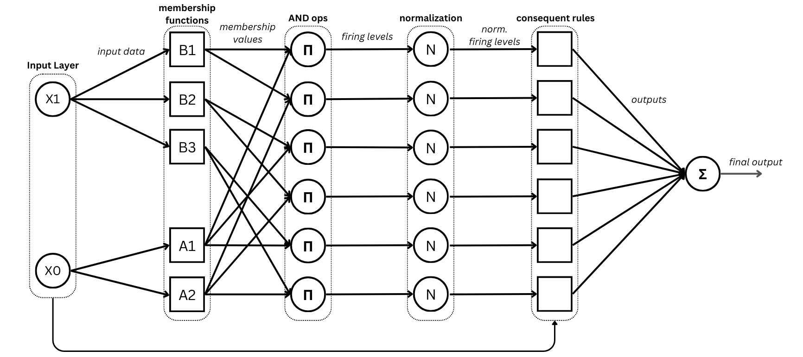
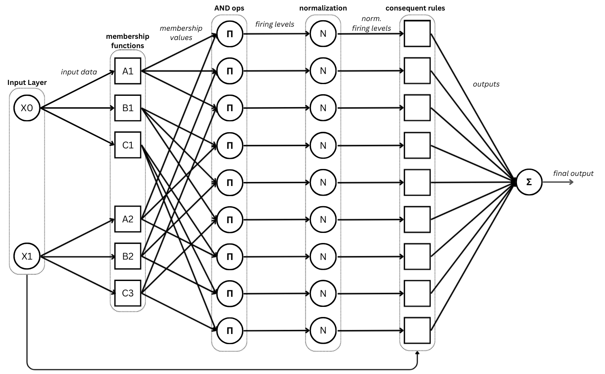
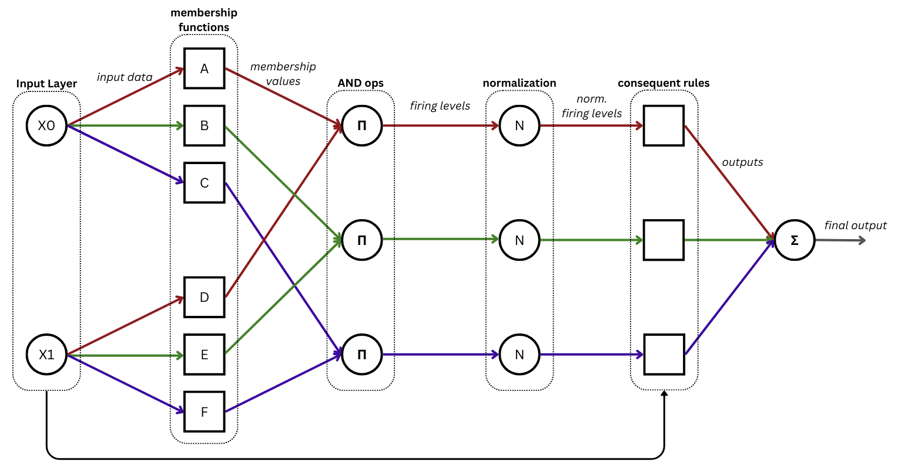
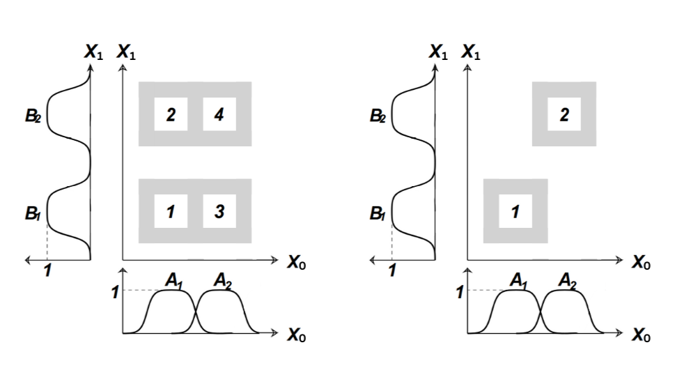

.. _anfis-variants-usage:

ANFIS variants
==============

Neuro-Fuzzy Toolbox provides three distinct classes for working with ANFIS
models. Each of them can handle both regression and classification problems
(binary and multiclass). The differences between these classes lie in the
internal structure of the model and in the way its parameters are stored.

1. Classical ANFIS
------------------
The classical ANFIS model (:class:`neuro_fuzzy_toolbox.models.ANFIS`) allows
a different number of membership functions (MFs) for each input feature.

    ANFIS model for 2-feature data, where the first feature has 2 membership
    functions and the second has 3 (source: authors).

The parameters available for instantiating an ANFIS model are the following:

- **mf_distribution**: List containing the number of MFs for each input
  feature.
- **outputs**: Number of model outputs. Default is 1.
- **membership_function**: MF to use. Default is ``GeneralizedBell_MF``.
- **output_type**: Defines the output layer of the model. Accepted values are
  ``'default'`` (no output layer; classical mode for regression problems),
  ``'sigmoid'`` (output layer with sigmoid activation), and ``'softmax'``
  (output layer with softmax activation). Default is ``'default'``.
- **features**: Iterable containing the names of the input variables as
  strings. Default is ``None``, which produces the list *[x0, x1, ...]*.
- **dtype**: Data type of the tensors holding the model parameters. Default is
  ``torch.float32``.

.. note::
    A simple instantiation example was already shown in the previous section
    (:ref:`ANFIS Model Basics <ANFIS usage>`).

.. _h-anfis-usage:

2. Homogeneous ANFIS
--------------------
The homogeneous ANFIS model (:class:`neuro_fuzzy_toolbox.models.h_ANFIS`) is
a classical ANFIS model in which all input features share the same number of
MFs. The only difference with respect to the classical ANFIS is the way the
premise parameters are stored: in this case they are stored in a single
tensor, which improves computational efficiency.

    ANFIS model for 2-feature data, where both features have 3 membership
    functions (source: authors).

The parameters available for instantiating this class are the following:

- **input_size**: Number of input features.
- **num_mfs**: Number of MFs per feature.
- **outputs**: Number of model outputs. Default is 1.
- **membership_function**: MF to use. Default is ``GeneralizedBell_MF``.
- **output_type**: Defines the output layer of the model. Accepted values are
  ``'default'`` (no output layer; classical mode for regression problems),
  ``'sigmoid'`` (output layer with sigmoid activation), and ``'softmax'``
  (output layer with softmax activation). Default is ``'default'``.
- **rule_reduced**: ``True`` to instantiate a rule-reduced ANFIS model,
  ``False`` otherwise. Default is ``False``.
- **features**: Iterable containing the names of the input variables as
  strings. Default is ``None``, which produces the list *[x0, x1, ...]*.
- **dtype**: Data type of the tensors holding the model parameters. Default is
  ``torch.float32``.

Unlike :class:`neuro_fuzzy_toolbox.models.ANFIS`, the number of features and
the number of MFs are specified separately, since all features are assumed to
share the same number of MFs.

.. important::
    The *rule_reduced* parameter allows a rule-reduced ANFIS model to be
    instantiated (see :ref:`rule-reduced ANFIS <rule-reduced ANFIS>`).

The key difference between both classes lies in the way the premise parameters
are stored.

.. table::
    :align: center

    +----------+-----------------------------------------------------------------------------------+
    | Class    | Premise structure                                                                 |
    +==========+===================================================================================+
    | ANFIS    | List of 2D tensors of shape :math:`(num\_mfs \times num\_params)`                 |
    +----------+-----------------------------------------------------------------------------------+
    | h_ANFIS  | Single 3D tensor of shape :math:`(input\_size \times num\_mfs \times num\_params)`|
    +----------+-----------------------------------------------------------------------------------+

.. note::
    More specifically, the premises in :class:`neuro_fuzzy_toolbox.models.ANFIS`
    are stored in an ``nn.ParameterList`` — a list of ``nn.Parameter`` objects,
    each associated with a specific input feature and holding a 2D tensor with
    the MF parameters for that feature (see the official documentation:
    `nn.Parameter <https://docs.pytorch.org/docs/stable/generated/torch.nn.parameter.Parameter.html>`_
    and
    `nn.ParameterList <https://docs.pytorch.org/docs/stable/generated/torch.nn.ParameterList.html>`_).
    In :class:`neuro_fuzzy_toolbox.models.h_ANFIS`, the premises are stored in
    a single ``nn.Parameter`` holding a 3D tensor with all premise parameters,
    which is what makes the operations computationally more efficient.

Example
^^^^^^^
The following example considers an ANFIS model for 4-feature data, where all
features have 3 MFs:

.. code-block:: python

    # Simulating a dataset of 200 samples with 4 features
    x_train = 2 * torch.rand(200, 4) - 1  # shape must be (200, 4)

Both classes are instantiated for comparison:

.. code-block:: python

    anfis_model = nft.ANFIS(
        mf_distribution=[3, 3, 3, 3],  # MF distribution across features
        membership_function=nft.Gaussian_MF
    )

    h_anfis = nft.h_ANFIS(
        input_size=x_train.shape[1],
        num_mfs=3,                      # same number of MFs per feature
        membership_function=nft.Gaussian_MF
    )

    # Initialize premises of both models with the same values for comparison
    anfis_model.init_premises(x_train)
    h_anfis.init_premises(x_train)

ANFIS (list structure)
""""""""""""""""""""""

.. code-block:: python

    anfis_model.get_premises()  # Output: list of tensors (one per feature) of shape (mfs × params)

.. code-block:: python

    [tensor([[-0.9999,  0.4968],
             [-0.0062,  0.4968],
             [ 0.9874,  0.4968]]),
     tensor([[-0.9844,  0.4941],
             [ 0.0039,  0.4941],
             [ 0.9921,  0.4941]]),
     tensor([[-9.9330e-01,  4.9635e-01],
             [-6.0350e-04,  4.9635e-01],
             [ 9.9209e-01,  4.9635e-01]]),
     tensor([[-9.9768e-01,  4.9846e-01],
             [-7.5603e-04,  4.9846e-01],
             [ 9.9617e-01,  4.9846e-01]])]

This method is designed to facilitate visualization and manipulation of the
premise parameters. Internally, however, the premises are stored in an
``nn.ParameterList`` where each element holds a 2D tensor of shape
:math:`(num\_mfs \times num\_params)` corresponding to a specific input
feature.

Using the *get_premises_as_parameters_list()* method returns:

.. code-block:: python

    anfis_model.get_premises_as_parameters_list()

.. code-block:: text

    ParameterList(
        (0): Parameter containing: [torch.float32 of size 3x2]
        (1): Parameter containing: [torch.float32 of size 3x2]
        (2): Parameter containing: [torch.float32 of size 3x2]
        (3): Parameter containing: [torch.float32 of size 3x2]
    )

h_ANFIS (3D tensor structure)
"""""""""""""""""""""""""""""

.. code-block:: python

    h_anfis.get_premises()  # Output: unified 3D tensor of shape (features × mfs × params)

.. code-block:: python

    tensor([[[-9.9992e-01,  4.9684e-01],
             [-6.2422e-03,  4.9684e-01],
             [ 9.8744e-01,  4.9684e-01]],

            [[-9.8438e-01,  4.9413e-01],
             [ 3.8766e-03,  4.9413e-01],
             [ 9.9214e-01,  4.9413e-01]],

            [[-9.9330e-01,  4.9635e-01],
             [-6.0350e-04,  4.9635e-01],
             [ 9.9209e-01,  4.9635e-01]],

            [[-9.9768e-01,  4.9846e-01],
             [-7.5603e-04,  4.9846e-01],
             [ 9.9617e-01,  4.9846e-01]]])

Using the *get_premises_as_parameters_list()* method returns:

.. code-block:: python

    h_anfis.get_premises_as_parameters_list()

.. code-block:: text

    [Parameter containing:
     tensor([[[-9.9992e-01,  4.9684e-01],
              [-6.2422e-03,  4.9684e-01],
              [ 9.8744e-01,  4.9684e-01]],
    
             [[-9.8438e-01,  4.9413e-01],
              [ 3.8766e-03,  4.9413e-01],
              [ 9.9214e-01,  4.9413e-01]],
    
             [[-9.9330e-01,  4.9635e-01],
              [-6.0350e-04,  4.9635e-01],
              [ 9.9209e-01,  4.9635e-01]],
    
             [[-9.9768e-01,  4.9846e-01],
              [-7.5603e-04,  4.9846e-01],
              [ 9.9617e-01,  4.9846e-01]]], requires_grad=True)]

.. _rule-reduced ANFIS:

3. Rule-reduced ANFIS
---------------------
The rule-reduced ANFIS model is a variant of the homogeneous ANFIS that
reduces the number of rules by associating each MF with a single input
feature. This means that each rule in the model is fully independent of the
others, since the combinatorial rule construction of the classical model
across MFs is not performed.

    Rule-reduced ANFIS model for 2-feature data, where both features have 3
    membership functions (source: authors).

This ANFIS variant is particularly useful when working with high-dimensional
datasets, since the number of rules and consequent parameters is considerably
reduced, enabling more efficient training.

The rule generation process is illustrated in the following comparison figure:

.. _comparison-rule-reduced-ANFIS-figure:

    Comparison between rule generation in a classical ANFIS model (left) and a
    rule-reduced ANFIS model (right) for 2-feature data, where both have 2 MFs
    per feature. In the classical model, rules are generated using all
    combinations of MFs; in the rule-reduced model, each MF in a feature is
    associated with a single rule together with exactly one MF from each of the
    remaining features (source: authors).

This model can be instantiated in two ways: using the dedicated
:class:`neuro_fuzzy_toolbox.models.rule_reduced_ANFIS` class (see
:ref:`rule-reduced ANFIS class <rule-reduced-ANFIS-class>`), or using
:class:`neuro_fuzzy_toolbox.models.h_ANFIS` with the additional parameter
*rule_reduced=True*.

3.1 Rule-reduced h_ANFIS
^^^^^^^^^^^^^^^^^^^^^^^^
As mentioned above, the rule-reduced ANFIS model can be instantiated using
:class:`neuro_fuzzy_toolbox.models.h_ANFIS` with *rule_reduced=True*:

.. code-block:: python

    # Simulating a dataset of 200 samples with 3 features
    x_train = 2 * torch.rand(200, 3) - 1  # shape must be (200, 3)

    rule_reduced_anfis = nft.h_ANFIS(
        input_size=x_train.shape[1],  # number of features, in this case 3
        num_mfs=3,                    # same number of MFs per feature
        membership_function=nft.GeneralizedBell_MF,
        rule_reduced=True             # enables rule-reduced mode
    )

.. tip::
    This variant is the most computationally efficient, as it leverages the
    internal structure of the ``h_ANFIS`` class: premises and consequents are
    each stored in a single 3D tensor of shape
    :math:`(input\_size \times num\_mfs \times num\_params)` and
    :math:`(outputs \times rules \times (input\_size + 1))` respectively, and
    the number of generated rules is reduced. The dedicated
    :ref:`rule-reduced ANFIS class <rule-reduced-ANFIS-class>` stores
    parameters differently, which has other advantages.

.. _rule-reduced-ANFIS-class:

3.2 Rule-reduced ANFIS class
^^^^^^^^^^^^^^^^^^^^^^^^^^^^^
:class:`neuro_fuzzy_toolbox.models.rule_reduced_ANFIS` is a dedicated class
for working with rule-reduced ANFIS models. In this class, both premise and
consequent parameters are stored differently from the other model classes.

The instantiation parameters are the same as those of the homogeneous ANFIS
model (:ref:`homogeneous ANFIS <h-anfis-usage>`), with one additional
parameter:

- **input_size**: Number of input features.
- **num_mfs**: Number of MFs per feature.
- **outputs**: Number of model outputs. Default is 1.
- **membership_function**: MF to use. Default is ``GeneralizedBell_MF``.
- **output_type**: Defines the output layer of the model. Accepted values are
  ``'default'`` (no output layer; classical mode for regression problems),
  ``'sigmoid'`` (output layer with sigmoid activation), and ``'softmax'``
  (output layer with softmax activation). Default is ``'default'``.
- **default_rule** (``EXPERIMENTAL``): ``True`` to include a default rule,
  ``False`` otherwise. Default is ``False``.
- **features**: Iterable containing the names of the input variables as
  strings. Default is ``None``, which produces the list *[x0, x1, ...]*.
- **dtype**: Data type of the tensors holding the model parameters. Default is
  ``torch.float32``.

.. caution::
    The ``default_rule`` parameter is under active development. Its behavior
    may change and some functionalities may not yet be available. It adds an
    extra firing level to capture all input combinations not covered by the
    model's reduced rule set.

The key difference between this class and
:class:`neuro_fuzzy_toolbox.models.h_ANFIS` with ``rule_reduced=True`` lies
in how the premise and consequent parameters are stored:

- The **premises** are stored in an ``nn.ParameterList`` where each element
  contains the MFs associated with a single **rule** of the model — that is,
  a 2D tensor of shape :math:`(input\_size \times num\_params)`, where
  :math:`num\_params` is the number of parameters of the chosen MF.
- The **consequents** are also stored in an ``nn.ParameterList``, where each
  element contains the consequent parameters associated with a single rule —
  that is, a 2D tensor of shape :math:`(outputs \times (input\_size + 1))`.

Although the internal storage differs from the ``h_ANFIS`` class, the API is
the same. The following example instantiates two rule-reduced ANFIS models
(one with each class) to illustrate their differences.

.. code-block:: python

    # Simulating a dataset of 200 samples with 4 features
    x_train = 2 * torch.rand(200, 4) - 1  # shape must be (200, 4)

    h_anfis_rule_reduced = nft.h_ANFIS(
        input_size=x_train.shape[1],  # number of features, in this case 4
        num_mfs=3,                    # same number of MFs per feature
        membership_function=nft.Gaussian_MF,
        rule_reduced=True
    )

    rule_reduced_anfis = nft.rule_reduced_ANFIS(
        input_size=x_train.shape[1],  # number of features, in this case 4
        num_mfs=3,                    # same number of MFs per feature
        membership_function=nft.Gaussian_MF
    )

    # Set both models to the same parameter values for comparison
    h_anfis_rule_reduced.set_premises(rule_reduced_anfis.get_premises())
    h_anfis_rule_reduced.set_consequents(rule_reduced_anfis.get_consequents())

Premises
""""""""
.. code-block:: python

    h_anfis_rule_reduced.get_premises()

    rule_reduced_anfis.get_premises()

Both return a 3D tensor of shape
:math:`(input\_size \times num\_mfs \times num\_params)`, where
:math:`num\_params` is the number of parameters of the chosen MF (in this
case ``Gaussian_MF`` with parameters :math:`\mu` and :math:`\sigma`).

.. code-block:: text

    tensor([[[ 0.0075,  0.9413],
             [-0.9569,  0.1347],
             [-0.8626,  0.9480]],
    
            [[-0.7637,  0.3460],
             [-0.5524,  0.1475],
             [ 0.1900,  0.3439]],
    
            [[ 0.8265,  0.4483],
             [ 0.5921,  0.9003],
             [-0.9505,  0.8001]],
    
            [[ 0.0264,  1.0643],
             [ 0.3168,  0.6440],
             [-0.4060,  0.5463]]])

However, calling *get_premises_as_parameters_list()* returns different
structures for each class:

h_anfis_rule_reduced instance
'''''''''''''''''''''''''''''
.. code-block:: python

    h_anfis_rule_reduced.get_premises_as_parameters_list()

.. code-block:: text

    [Parameter containing:
     tensor([[[ 0.0075,  0.9413],
              [-0.9569,  0.1347],
              [-0.8626,  0.9480]],
    
             [[-0.7637,  0.3460],
              [-0.5524,  0.1475],
              [ 0.1900,  0.3439]],
    
             [[ 0.8265,  0.4483],
              [ 0.5921,  0.9003],
              [-0.9505,  0.8001]],
    
             [[ 0.0264,  1.0643],
              [ 0.3168,  0.6440],
              [-0.4060,  0.5463]]], requires_grad=True)]

rule_reduced_ANFIS instance
'''''''''''''''''''''''''''
.. code-block:: python

    rule_reduced_anfis.get_premises_as_parameters_list()

.. code-block:: text

    ParameterList(
        (0): Parameter containing: [torch.float32 of size 4x2]
        (1): Parameter containing: [torch.float32 of size 4x2]
        (2): Parameter containing: [torch.float32 of size 4x2]
    )

To inspect the values of each element:

.. code-block:: python

    for i, rule in enumerate(rule_reduced_anfis.get_premises_as_parameters_list()):
        print(f"Rule {i+1} premises:\n", rule, "\n")

.. code-block:: text

    Rule 1 premises:
     Parameter containing:
    tensor([[ 0.0075,  0.9413],
            [-0.7637,  0.3460],
            [ 0.8265,  0.4483],
            [ 0.0264,  1.0643]], requires_grad=True) 

    Rule 2 premises:
     Parameter containing:
    tensor([[-0.9569,  0.1347],
            [-0.5524,  0.1475],
            [ 0.5921,  0.9003],
            [ 0.3168,  0.6440]], requires_grad=True) 

    Rule 3 premises:
     Parameter containing:
    tensor([[-0.8626,  0.9480],
            [ 0.1900,  0.3439],
            [-0.9505,  0.8001],
            [-0.4060,  0.5463]], requires_grad=True)

As noted above, each tensor has shape :math:`(input\_size \times num\_params)`,
where :math:`num\_params` is the number of parameters of the chosen MF. In
this case ``Gaussian_MF`` uses parameters :math:`[\mu, \sigma]`, and each
set of :math:`input\_size` pairs (4 in this example) is combined to form one
rule, giving a total of 3 rules.

.. tip::

    The *get_premises_as_parameters_list()* method is useful for initializing
    PyTorch optimizers when implementing custom training procedures. See
    :ref:`Custom training <custom-training>` for details.

Consequents
"""""""""""
The same pattern applies to the consequent parameters:

.. code-block:: python

    h_anfis_rule_reduced.get_consequents()

    rule_reduced_anfis.get_consequents()

Both return a 3D tensor of shape
:math:`(outputs \times rules \times (input\_size + 1))`, where the
:math:`+1` corresponds to the bias term.

.. code-block:: text

    tensor([[[-0.0272,  0.0149, -0.0077,  0.4051,  0.4818],
             [ 0.7763, -0.9301,  0.4228,  0.0454, -0.3164],
             [ 0.8950, -0.8065, -0.5194,  0.7518, -0.2449]]])

.. note::
    The classical ANFIS model generates rules using all possible combinations
    of MFs, so the number of rules would be :math:`num\_mfs^{input\_size}`
    (in this case :math:`3^4 = 81`), with each rule having
    :math:`input\_size + 1` consequent parameters (5 in this case, including
    the bias). In the rule-reduced model, however, rules are not generated
    combinatorially: each MF in a given feature is associated with a single
    rule, together with exactly one MF from each of the remaining features.
    This means the number of rules equals the number of MFs per feature, which
    is 3 in this case (see the
    :ref:`comparison figure <comparison-rule-reduced-ANFIS-figure>` for a
    visual illustration of the difference).

Calling *get_consequents_as_parameters_list()* again returns different
structures for each class:

h_anfis_rule_reduced instance
'''''''''''''''''''''''''''''
.. code-block:: python

    h_anfis_rule_reduced.get_consequents_as_parameters_list()

.. code-block:: text

    [Parameter containing:
     tensor([[[-0.0272,  0.0149, -0.0077,  0.4051,  0.4818],
              [ 0.7763, -0.9301,  0.4228,  0.0454, -0.3164],
              [ 0.8950, -0.8065, -0.5194,  0.7518, -0.2449]]], requires_grad=True)]

rule_reduced_ANFIS instance
'''''''''''''''''''''''''''
.. code-block:: python

    rule_reduced_anfis.get_consequents_as_parameters_list()

.. code-block:: text

    ParameterList(
        (0): Parameter containing: [torch.float32 of size 1x5]
        (1): Parameter containing: [torch.float32 of size 1x5]
        (2): Parameter containing: [torch.float32 of size 1x5]
    )

To inspect the values of each element:

.. code-block:: python

    for i, rule in enumerate(rule_reduced_anfis.get_consequents_as_parameters_list()):
        print(f"Rule {i+1} consequents:\n", rule, "\n")

.. code-block:: text

    Rule 1 consequents:
     Parameter containing:
    tensor([[-0.0272,  0.0149, -0.0077,  0.4051,  0.4818]], requires_grad=True) 

    Rule 2 consequents:
     Parameter containing:
    tensor([[ 0.7763, -0.9301,  0.4228,  0.0454, -0.3164]], requires_grad=True) 

    Rule 3 consequents:
     Parameter containing:
    tensor([[ 0.8950, -0.8065, -0.5194,  0.7518, -0.2449]], requires_grad=True)

Each tensor has shape :math:`(outputs \times (input\_size + 1))`, where the
:math:`+1` corresponds to the bias term. In other words, each tensor holds the
consequent parameters associated with a single rule (for each model output;
1 in this case).

Rules-based storage structure
""""""""""""""""""""""""""""""
As described above, :class:`neuro_fuzzy_toolbox.models.rule_reduced_ANFIS`
stores premises and consequents in parameter lists where each element is
associated with a specific rule. This design is intended to facilitate
manipulation of the model's rule structure.

.. note::
    This is leveraged by the :ref:`SONFIS <sonfis-usage>` algorithm, and may
    also be useful for :ref:`Custom Training <custom-training>`.