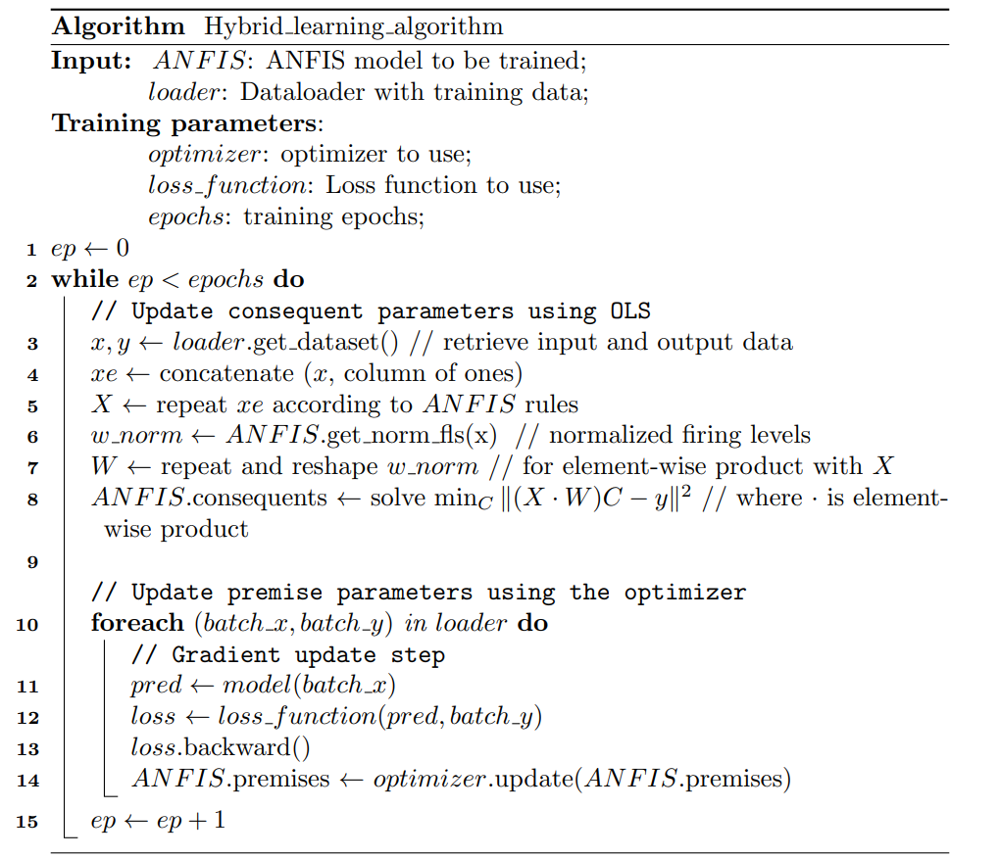

.. _hybrid_learning_usage:

Hybrid Learning Algorithm
=========================
The classical hybrid learning algorithm for ANFIS models. It combines least
squares estimation for the consequent parameters with an optimizer-based
training mechanism for the premise parameters.

    Hybrid Learning Algorithm pseudocode (source: adapted from Jang (1993)).

.. important::
    This algorithm is applicable to all ANFIS models available in
    Neuro-Fuzzy Toolbox (i.e., any model that inherits from ``base_ANFIS``:
    ``ANFIS``, ``h_ANFIS``, and ``rule_reduced_ANFIS``).

.. note::
    - This algorithm is an implementation of a variant of the hybrid learning
      procedure proposed by Jang in 1993. For more information, refer to the
      original paper:
      `ANFIS: Adaptive-Network-Based Fuzzy Inference System <https://doi.org/10.1109/21.256541>`_.
    - For more details on its implementation in the toolbox, see
      :ref:`Hybrid Learning Algorithm`.

Instantiation
-------------
The following parameters are available when instantiating this training
algorithm:

- **epochs**: Number of training epochs.
- **loss_function**: Instantiated loss function to use during training
  (e.g., ``torch.nn.MSELoss()``).
- **driver**: Backend function used for least squares estimation. Valid values
  are ``'gels'``, ``'gelsy'``, ``'gelsd'``, and ``'gelss'``. If ``None``,
  defaults to ``'gels'`` (Default: ``None``).
- **ridge_lambda**: Lambda value for Ridge regularization in the least squares
  estimation of consequents. If 0, no regularization is applied
  (Default: ``0.``).
- **early_stopping**: Early stopping mechanism to use during training
  (Default: ``None``).
- **optimizer**: Optimizer class to use during training
  (Default: ``torch.optim.Adam``).
- **optimizer_params**: Parameters to pass to the optimizer (Default: ``{}``).

.. code-block:: python

    import neuro_fuzzy_toolbox as nft
    import torch
    import torch.nn as nn

    trainer = nft.Hybrid_learning_algorithm(
        epochs=500,
        loss_function=nn.MSELoss(),
        optimizer=torch.optim.AdamW,
        optimizer_params={'lr': 1e-3, 'weight_decay': 1e-2},
        early_stopping=nft.EarlyStopping(patience=30, delta=1e-4)
    )

The following arguments are available when calling the training algorithm
via ``__call__``:

- **model**: ANFIS model to train.
- **train_loader**: DataLoader with the training data.
- **val_loader**: DataLoader with the validation data (Default: ``None``).
- **verbose**: Whether to print progress messages (Default: ``True``).

.. code-block:: python

    # Assuming "model" is the instantiated ANFIS model,
    # "train_loader" and "val_loader" are PyTorch DataLoaders

    trainer(model, train_loader, val_loader)

.. important::
    The training batch size is determined by the DataLoader, so this should
    be taken into account when defining it (see
    :ref:`PyTorch DataLoaders <DataLoaders_usage>`).