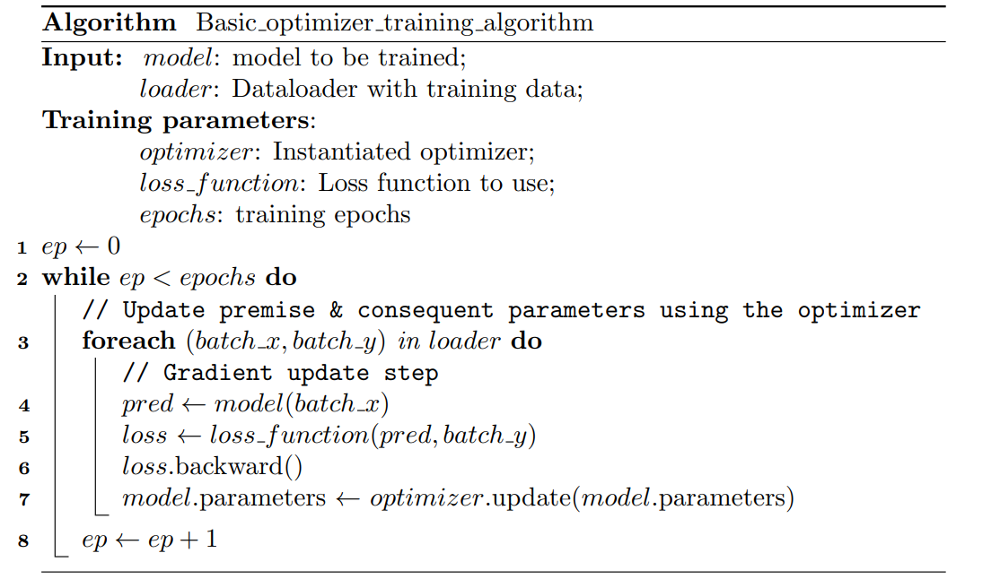

.. _basic_optimizer:

Basic Optimizer Training Algorithm
===================================
A gradient-based training algorithm compatible with any custom model that
inherits from PyTorch's ``nn.Module`` base class.

.. note::
    - For more details on its implementation in the toolbox, see :ref:`Basic Optimizer Based Training Algorithm`.

Instantiation
-------------
The following parameters are available when instantiating this training
algorithm:

- **epochs** (``int``): Number of training epochs.
- **loss_function** (``torch.nn.Module``): Instantiated loss function to use
  during training (e.g., ``torch.nn.CrossEntropyLoss()``).
- **early_stopping** (``nft.EarlyStopping``): Early stopping mechanism to use
  during training (Default: ``None``).
- **optimizer** (``torch.optim.Optimizer``): Optimizer class to use during
  training.
- **optimizer_params** (``dict``): Additional parameters to pass to the
  optimizer (Default: ``{}``).

Example
^^^^^^^
Instantiating the algorithm:

.. code-block:: python

    import neuro_fuzzy_toolbox as nft
    import torch
    import torch.nn as nn

    trainer = nft.Basic_optimizer_training_algorithm(
        epochs=500,
        loss_function=nn.CrossEntropyLoss(),
        optimizer=torch.optim.AdamW,
        optimizer_params={'lr': 1e-3, 'weight_decay': 1e-2},
        early_stopping=nft.EarlyStopping(patience=30, delta=1e-4)
    )

Assuming ``model`` is an instantiated ANFIS model and ``train_loader``
and ``val_loader`` are PyTorch DataLoaders, training is invoked as follows:

.. code-block:: python

    trainer(model, train_loader, val_loader)

.. important::
    The training batch size is determined by the DataLoader, so this should
    be taken into account when defining it (see
    :ref:`PyTorch DataLoaders <DataLoaders_usage>`).